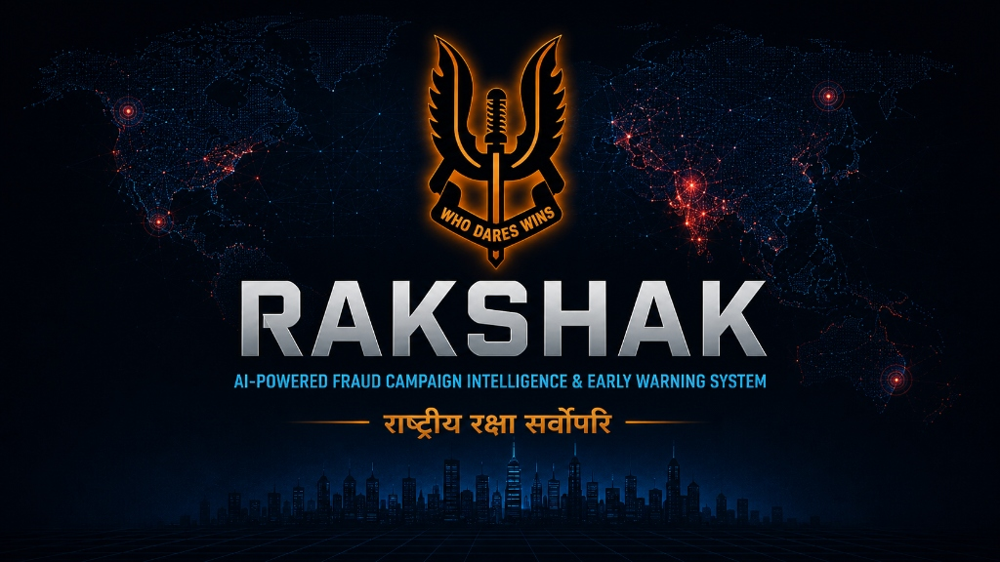

<div align="center">
  
  
  <h1>🛡️ Cyber Sentinel</h1>
  <h3>AI-Powered Fraud Campaign Intelligence & Early Warning System</h3>
  
  <p>
    
    
    
    
    
    
  </p>
  
  <p>
    <strong>Built for Cyber Police · Law Enforcement · Government Security Organizations</strong>
  </p>
</div>

---

## 📌 Overview

**Cyber Sentinel** is a production-grade, AI-powered cyber intelligence platform designed to shift law enforcement from a **reactive** to a **proactive** cyber threat detection model.

Instead of discovering fraud campaigns after victims have already lost money, Cyber Sentinel continuously monitors **public, legally accessible sources** and uses AI/ML to:

- 🔍 **Detect** fraud campaigns early in their lifecycle
- 🧬 **Extract** structured ScamDNA fingerprints from threat content
- 🏷️ **Cluster** related threats into campaigns using semantic AI
- 📊 **Score** threats with a multi-factor risk model
- 🗺️ **Map** geographic threat distribution
- ⚠️ **Alert** law enforcement with actionable intelligence

---

## ⚖️ Legal & Ethical Framework

> This system collects **ONLY** publicly available information through legal OSINT methods.

| ✅ Included | ❌ Excluded |
|---|---|
| Public Telegram channels | Private messages/groups |
| Public news RSS feeds | Surveillance data |
| Public scam reports | Unauthorized access |
| Public threat intelligence feeds | Non-public information |
| Legally accessible APIs | Private communications |

---

## 🏗️ Architecture

```
Public Sources (RSS, Telegram, Manual)
         │
         ▼
  ┌─────────────────┐
  │  Data Collection │  ← RSS Collector + Telegram OSINT
  └────────┬────────┘
           │
           ▼
  ┌─────────────────┐
  │  AI Pipeline    │  ← DistilBERT + Sentence Transformers
  │                 │
  │  1. Classify    │  ← Zero-shot NLP Classification (10 scam types)
  │  2. ScamDNA     │  ← URL, Phone, Geo, Keyword, Psych Trigger extraction
  │  3. Cluster     │  ← Cosine similarity campaign grouping
  │  4. Risk Score  │  ← 6-factor weighted scoring formula
  └────────┬────────┘
           │
           ▼
  ┌─────────────────┐
  │  SQLite / DB    │  ← RawIntel + ScamArtifact + ThreatHistory + Campaign
  └────────┬────────┘
           │
           ▼
  ┌─────────────────┐
  │  FastAPI REST   │  ← 8 RESTful endpoints with validation
  └────────┬────────┘
           │
           ▼
  ┌─────────────────┐
  │  Streamlit UI   │  ← 7-view Command Center Dashboard
  └─────────────────┘
```

---

## 🚀 Quick Start

### Prerequisites
- Python 3.11+
- Git

### 1. Clone the Repository
```bash
git clone https://github.com/AYUSH7298/-Cyber-Sentinel.git
cd cyber-sentinel/cyber_sentinel
```

### 2. Create Virtual Environment
```bash
python -m venv .venv
# Windows:
.venv\Scripts\activate
# Linux/Mac:
source .venv/bin/activate
```

### 3. Install Dependencies
```bash
pip install -r requirements.txt
```

### 4. Configure Environment
```bash
cp .env.example .env
# Edit .env with your Telegram API credentials (optional for MVP)
```

### 5. Launch Cyber Sentinel
```bash
# Option A: One-command launcher
python run_project.py

# Option B: Manual (two terminals)
# Terminal 1 - Backend:
python -m uvicorn app.main:app --host 127.0.0.1 --port 8080 --reload

# Terminal 2 - Dashboard:
python -m streamlit run dashboard/app_ui.py --server.port 8501
```

### 6. Access
| Service | URL |
|---|---|
| 🎨 Dashboard | http://localhost:8501 |
| 📡 API Docs (Swagger) | http://localhost:8080/docs |
| 🔍 API Docs (ReDoc) | http://localhost:8080/redoc |
| ❤️ Health Check | http://localhost:8080/health |

---

## 🐳 Docker Deployment

```bash
# Build and start all services
docker-compose up --build

# Run in background
docker-compose up -d --build

# Stop all services
docker-compose down
```

---

## 🧬 ScamDNA Framework

Every piece of intelligence is converted into a structured **ScamDNA fingerprint**:

```json
{
  "scam_type": "KYC Scam",
  "confidence": 0.89,
  "platform": "telegram:fraud_alerts_india",
  "keywords": ["kyc update", "account suspended", "verify now"],
  "urls": ["http://sbi-kyc-fake-portal.com"],
  "phone_numbers": ["+91 9876543210"],
  "geo_references": ["Gurugram", "Haryana"],
  "psychological_triggers": ["immediately", "suspended", "blocked"],
  "payment_indicators": ["upi", "paytm"],
  "risk_score": 87.5,
  "campaign_id": "CAMP_003",
  "verdict": "Highly Critical"
}
```

---

## 🤖 AI/ML Models

| Component | Model | Purpose |
|---|---|---|
| Scam Classifier | DistilBERT MNLI | Zero-shot classification into 10 scam categories |
| Campaign Clusterer | all-MiniLM-L6-v2 | Semantic similarity for campaign detection |
| Geo NER | Regex + patterns | Indian city/state extraction |
| Risk Scorer | Rule-based | 6-factor weighted formula |

**10 Scam Categories Supported:**
`Job Scam` · `Loan Scam` · `Investment Scam` · `UPI Fraud` · `KYC Scam` · `Phishing` · `Sextortion` · `Crypto Scam` · `Fake Government Scheme` · `Courier Parcel Scam`

---

## 📡 API Endpoints

| Method | Endpoint | Description |
|---|---|---|
| GET | `/health` | Health check |
| POST | `/api/v1/intel/manual` | Ingest a single threat report |
| POST | `/api/v1/collect/rss` | Trigger RSS feed collection |
| POST | `/api/v1/collect/telegram` | Trigger Telegram channel scraping |
| GET | `/api/v1/analytics/dashboard-feed` | Full dashboard data |
| GET | `/api/v1/analytics/threat-history` | Audit log of threats |
| GET | `/api/v1/analytics/campaigns` | Aggregated campaign stats |
| PUT | `/api/v1/alerts/{campaign_id}/status` | Update case status |

---

## 🖥️ Dashboard Views

| View | Description |
|---|---|
| 📊 System Overview | KPI metrics, charts, urgent alerts queue |
| 🏷️ Active Campaigns | Campaign registry with intelligence details panel |
| 🚨 Live Threat Feed | Searchable log with XAI explanations |
| 🗺️ Geographic Radar | Folium map of infrastructure and hotspots |
| ⚠️ Actionable Alerts | Case management (New/Under Investigation/Resolved) |
| 📥 Evidence & Ingestion | Manual input, scanner triggers, CSV export |
| ⚙️ System Control | Mock data seeder, DB reset, diagnostics |

---

## 🗂️ Project Structure

```
cyber_sentinel/
├── app/
│   ├── __init__.py
│   ├── main.py              # FastAPI application & endpoints
│   ├── models.py            # SQLAlchemy ORM models
│   ├── database.py          # DB engine & session management
│   ├── config.py            # Pydantic settings
│   ├── ai/
│   │   ├── classifier.py    # Zero-shot scam classification
│   │   ├── dna_extractor.py # ScamDNA extraction engine
│   │   ├── clusterer.py     # Semantic campaign clustering
│   │   └── pipeline.py      # Orchestration pipeline
│   └── collectors/
│       ├── news_scraper.py   # RSS/Atom feed collector
│       └── telegram_osint.py # Telegram public channel collector
├── dashboard/
│   └── app_ui.py            # Streamlit 7-view dashboard
├── tests/
│   └── test_core.py         # Pytest test suite
├── .streamlit/
│   └── config.toml          # Streamlit theme config
├── .env.example             # Environment template
├── .gitignore
├── Dockerfile
├── docker-compose.yml
├── requirements.txt
└── run_project.py           # One-click launcher
```

---

## 🧪 Running Tests

```bash
# Run all tests
pytest tests/ -v

# Run with coverage
pip install pytest-cov
pytest tests/ -v --cov=app --cov-report=html
```

---

## 📊 Risk Scoring Formula

```
Risk Score = (35% × Scam Type Severity)
           + (20% × AI Confidence)
           + (20% × URL Count Factor)
           + (15% × Keyword Match Factor)
           +  (5% × Phone Number Factor)
           +  (5% × Psychological Trigger Factor)
```

| Score | Verdict |
|---|---|
| 75–100 | 🔴 Highly Critical |
| 50–74 | 🟠 Suspicious (High Risk) |
| 25–49 | 🟡 Suspicious (Medium Risk) |
| 1–24 | 🟢 Suspicious (Low Risk) |

---

## 🔧 Telegram Setup (Optional)

1. Visit https://my.telegram.org/apps
2. Create an app → copy `api_id` and `api_hash`
3. Add to `.env`: `TG_API_ID=your_id` and `TG_API_HASH=your_hash`
4. Run one-time authorization:
```bash
python -c "import asyncio; from app.collectors.telegram_osint import authorize_session; asyncio.run(authorize_session())"
```
5. Restart the application

---

## 🗺️ Roadmap

### Phase 1: MVP (3 Weeks — Current)
- [x] RSS news collection
- [x] Telegram OSINT collection  
- [x] AI scam classification (10 categories)
- [x] ScamDNA extraction engine
- [x] Campaign clustering
- [x] Risk scoring
- [x] Streamlit dashboard (7 views)
- [x] Case management

### Phase 2: Advanced Prototype (2 Months)
- [ ] VirusTotal URL enrichment
- [ ] WHOIS domain intelligence
- [ ] Twitter/X OSINT integration
- [ ] Advanced geographic NER (spaCy)
- [ ] Trend anomaly detection
- [ ] Email alert notifications
- [ ] PostgreSQL migration

### Phase 3: Production (6 Months)
- [ ] React.js production frontend
- [ ] JWT authentication & RBAC
- [ ] Neo4j graph infrastructure correlation
- [ ] Kubernetes deployment
- [ ] National-scale data pipeline

---

## 🤝 Contributing

1. Fork the repository
2. Create a feature branch: `git checkout -b feature/your-feature`
3. Commit your changes: `git commit -m 'Add feature'`
4. Push to branch: `git push origin feature/your-feature`
5. Open a Pull Request

---

## 📜 License

MIT License — see [LICENSE](LICENSE) file.

---

## 👨‍💻 Author

**Cyber Police Internship Project**  
Built for: Gurugram Police Cyber Cell  
Portal: RAKSHAK Command Center v2.0

---

<div align="center">
  <strong>Built with ❤️ for Cyber Safety in India</strong>
</div>
