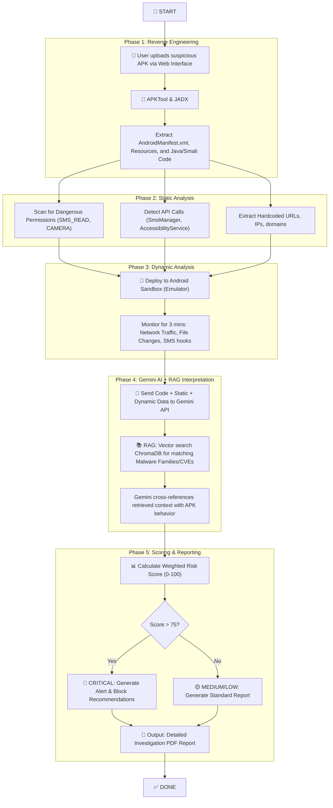

# CyberShield: GenAI-Powered Automated APK Malware Analysis & Risk Scoring

---

## 1. Problem Statement: Detailed Explanation

### The Core Issue
Fraudsters are increasingly targeting banking customers by distributing **malicious Android applications (APKs)**. These are often disguised as legitimate apps and are distributed via WhatsApp, SMS (smishing), phishing emails, and fake websites. 

Once installed, these fraudulent APKs execute severe attacks, including:
- **Credential Theft:** Using overlay screens to steal banking usernames, passwords, and PINs.
- **OTP Interception:** Abusing SMS permissions to read and forward One-Time Passwords, bypassing Two-Factor Authentication (2FA).
- **Screen Recording:** Visually capturing sensitive data while the user interacts with their device.
- **Data Exfiltration:** Silently stealing contacts, photos, and files.

### Why Manual Analysis Fails
Currently, when a suspicious APK is reported, cybersecurity experts must manually reverse-engineer and analyze it. This process has critical bottlenecks:
1. **Time-Intensive:** It takes 4 to 8 hours to manually analyze a single APK.
2. **Volume Constraints:** With hundreds of suspicious APKs generated daily, analysts can only process a fraction (often under 5%). The vast majority go unchecked.
3. **Reactive:** The time delay in manual analysis means the damage (financial loss) is often already done by the time the malware is identified.

### The Objective
To build an **Automated Malware Analysis System** that leverages **Generative AI (Gemini)** and **RAG (Retrieval-Augmented Generation)** to automatically reverse-engineer, statically/dynamically analyze, interpret malicious intent, and generate a quantified **Risk Score** (0-100) along with an actionable investigation report in minutes rather than hours.

---

## 2. Four Approaches to Solve the Problem

Here are four distinct architectural approaches to building this system, ranging from simple to highly complex.

### Approach 1: Modular Sequential Pipeline (Recommended for MVP)
A linear, stage-by-stage pipeline where each module performs a specific task and passes results to the next. 
- **How it works:** The APK is uploaded, decompiled, statically analyzed, and then dynamically executed. The collected data is passed to Gemini, which uses RAG to cross-reference known threat intelligence and generates a final report.
- **Best for:** Hackathons, MVP development, and batch processing where a few minutes of wait time is acceptable.

### Approach 2: Agentic AI Multi-Agent System
Multiple autonomous AI agents specialized in specific domains collaborate to analyze the APK.
- **How it works:** A Coordinator Agent receives the APK and deploys specialist agents (Reverse Engineering Agent, Static Agent, Network Agent). They all work in parallel, depositing findings into a shared memory. A Gemini Reasoning Agent looks at all findings, consults a RAG Agent, and calculates the risk.
- **Best for:** Deep, thorough investigations of highly obfuscated malware.

### Approach 3: Hybrid Ensemble Scoring with RAG
An ensemble approach where multiple independent analyzers score the APK, and a meta-classifier combines them.
- **How it works:** Rule-based (YARA), ML-based, dynamic sandbox, and Gemini AI analyzers all independently evaluate the APK and assign a score out of 100. A meta-classifier (powered by Gemini) weighs these scores based on their confidence levels to produce the final risk score.
- **Best for:** High-accuracy requirements in enterprise banking environments.

### Approach 4: Real-Time Stream Processing
An event-driven architecture designed to process hundreds of APKs continuously.
- **How it works:** APKs are ingested into a message queue (RabbitMQ/Redis). Microservice worker pools grab the APKs, analyze them, and push results back to a stream. Gemini processes the streams in real-time, publishing instant alerts to a WebSocket dashboard if high-risk thresholds are crossed.
- **Best for:** Real-time fraud prevention and high-volume, continuous monitoring.

---

## 3. End-to-End Workflow & Flowchart (Based on Modular Pipeline)

Here is how the system will work step-by-step from upload to final report generation.



### RAG Integration Explained
We will not just rely on Gemini's base knowledge. We will inject **RAG (Retrieval-Augmented Generation)**.
1. **Ingestion:** We embed MITRE ATT&CK docs, known malware profiles (e.g., Joker, Anubis), and past analysis reports into a **ChromaDB** vector store using Gemini Embeddings.
2. **Retrieval:** When analyzing a new APK, we convert its static/dynamic findings into vectors and query ChromaDB for similar past threats.
3. **Generation:** Gemini reads the APK code *alongside* the retrieved threat intel to confidently declare, *"This matches the behavior of the Anubis banking trojan."*

---

## 4. Technical Stack

We will build this using modern, scalable technologies.

| Category | Technology | Purpose |
| :--- | :--- | :--- |
| **Frontend UI** | React.js + Vite | Upload dashboard, Risk Gauge, Timeline, and Report viewer. |
| **Backend API** | Python + FastAPI | Handling uploads, orchestrating the analysis pipeline. |
| **Generative AI** | Google Gemini API | `gemini-2.5-pro` for deep code analysis and report generation. |
| **RAG System** | LangChain + ChromaDB | Vector database to store and retrieve threat intelligence. |
| **Embeddings** | Gemini `text-embedding-004`| Converting threat docs into searchable vectors. |
| **Reverse Eng.** | APKTool + JADX | Decompiling APKs into readable source code. |
| **Static Analysis** | Python (androguard) | Extracting permissions, certificates, and strings. |
| **Dynamic Analysis**| Android Emulator + Frida| Sandbox execution and runtime hooking. |

---

## 5. Folder Architecture

This modular folder structure ensures clean separation of concerns:

```text
cybershield/
│
├── frontend/                         # React UI
│   ├── src/
│   │   ├── components/               # Upload widget, Risk Gauges, Charts
│   │   ├── pages/                    # Dashboard, ReportView
│   │   └── services/                 # API connection to backend
│
├── backend/                          # FastAPI Server
│   ├── main.py                       # API Entry point
│   ├── routes/                       # /upload, /analyze, /report endpoints
│   ├── services/                     # Core Logic
│   │   ├── reverse_engineering.py    # Trigger APKTool/JADX
│   │   ├── static_analysis.py        # Parse manifest and code
│   │   ├── dynamic_analysis.py       # Interact with Android Emulator
│   │   ├── gemini_service.py         # Gemini API prompt handling
│   │   ├── rag_service.py            # Langchain + ChromaDB logic
│   │   └── risk_scoring.py           # Mathematical risk calculation
│
├── rag_knowledge_base/               # Data to be embedded into ChromaDB
│   ├── mitre_attack_mobile.md
│   ├── banking_trojans_intel.md
│   └── cve_database.json
│
├── sandbox/                          # Dynamic analysis tools
│   ├── frida_scripts/                # Scripts to hook SMS and network
│   └── emulator_config/              
│
├── uploads/                          # Temp folder for user APKs
└── reports/                          # Generated PDF/Markdown outputs
```
